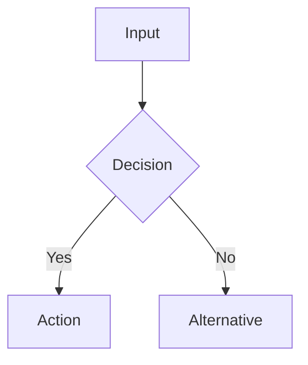

# Revision Prompt Library

These prompts are safe replacements for detector-evasion prompts. They target generic AI-like prose while preserving academic integrity and LaTeX structure.

## Segment JSON Prompt

Use this when filling a `revision_packet.json` segment.

You are revising one LaTeX academic prose segment.

Context:
- Section mode: `{{SECTION_MODE}}`
- Section hint: `{{SECTION_HINT}}`
- Detected language: `{{LANGUAGE}}`
- Protected tokens that must remain byte-for-byte unchanged:
{{PROTECTED_TOKENS}}

Non-negotiable constraints:
- Preserve every protected token exactly.
- Preserve LaTeX syntax, math, citations, labels, references, commands, and environment names.
- Do not add citations, data, examples, experimental results, or claims not present in the source.
- Do not promise or discuss detector scores.
- Keep the original language.
- Keep the claim strength the same or more cautious.

Revision objectives:
- Reduce generic AI-like phrasing by improving specificity and local logic.
- Replace vague transitions with the real relation between ideas.
- Use field-appropriate terminology without adding unsupported jargon.
- Improve paragraph progression when the source is jumpy: make each paragraph's opening and closing connect to nearby context.
- Split complex sentences so each sentence carries one core idea.
- Vary sentence rhythm without inserting casual filler.
- Keep paragraph boundaries and overall meaning stable.

Return only strict JSON:

```json
{
  "revised_text": "revised LaTeX segment here",
  "revision_note": "one concise sentence explaining the change",
  "risk_flags": []
}
```

Original segment:

```latex
{{TEXT}}
```

## Universal LaTeX Revision Prompt

Revise the following LaTeX academic prose for clarity, specificity, and natural scholarly voice.

Constraints:
- Preserve all LaTeX commands, citations, labels, references, equations, variables, and environment syntax exactly.
- Do not add citations, data, claims, or examples that are not present in the source.
- Keep the original language.
- Keep paragraph boundaries unless a restructure is requested.
- Reduce generic AI-like phrasing by making claims more bounded, concrete, and context-aware.
- If restructuring is requested, organize ideas by natural progression: context, problem, method, evidence, limitation, and implication.
- Match vocabulary to the intended reader when specified: simplify unexplained terminology for general readers, and keep precise field terms for expert readers.
- Output only the revised LaTeX passage.

Text:

```latex
{{TEXT}}
```

## Chinese Academic Prose

Revise the Chinese academic LaTeX passage below.

Focus:
- Replace empty connective chains with specific logical relations.
- Reduce repetitive patterns such as "首先/其次/最后", "具有重要意义", "本文旨在".
- Replace broad verbs such as "进行分析", "开展研究", "实现优化" with concrete actions when the source supports it.
- Use cautious academic wording for unquantified claims, such as "说明", "表明", "在该场景下".
- Rebuild local paragraph flow when requested: make the first sentence inherit the previous context and the final sentence point to the next idea.
- Keep one core point per sentence; split long clauses before polishing vocabulary.
- Alternate concise explanatory sentences with slightly longer evidence sentences to avoid mechanical rhythm.
- Keep technical terms, dataset names, model names, variables, citations, and formulas unchanged.
- Prefer restrained academic prose over promotional tone.
- Keep meaning and claim strength unchanged.

Output only the revised LaTeX passage.

## Chinese Thesis Humanization Prompt

Use this for Chinese graduation-thesis or technical-report prose that has been flagged as generic, AI-like, too neat, too abstract, or too verbose.

Task:
- First diagnose the sentence-level problems.
- Then rewrite into concise, concrete, thesis-appropriate Chinese.
- Keep the wording natural enough to sound like an author explaining a real project, but not casual or chatty.

High-priority issues to fix:
- Empty objective chains: "设计/实现/构建/提供/形成" plus "机制/链路/能力/体系/方案".
- Over-neat parallelism: repeated "关注……目标是……" or list-like summaries that hide the actual work.
- Abstract noun stacking: too many "机制、链路、闭环、价值、能力、支撑、沉淀、复用".
- Unsupported value claims: "降低风险、提升效率、提供保护、具备能力" without a concrete scene.
- Boilerplate transitions: "基于上述问题、这表明、需要补充说明的是、全文共分为六章".
- Fixed sequence transitions: dense "首先、其次、最后" patterns that hide the actual logic.
- Meta thesis self-reference: "毕业设计周期、毕业论文中、论文写作时、本毕业设计" used inside normal thesis prose.
- Unsupported personalization: "我观察到、对我而言、让我印象最深的是" without a reflective scene or source support.
- Long overloaded sentences mixing background, method, value, and implementation.

Rewrite rules:
- Preserve all LaTeX commands, citations, labels, equations, code identifiers, module names, and technical terms.
- Do not add facts, citations, experiments, source-code details, or examples that are not already present.
- Shorten before adding detail.
- Do not mention "graduation thesis/design", "paper writing", or assignment-cycle context in the revised passage unless the source section explicitly requires that topic.
- Use concrete anchors already present in the source: commands, modules, APIs, logs, tests, workflows, pages, endpoints, or code files.
- Prefer "用来识别/先提示/接到具体链路里/把范围缩小/在该原型中" over "提供帮助/具备能力/形成闭环".
- Improve paragraph-level coherence: remove jumpy transitions, keep each paragraph focused on one local claim, and make adjacent paragraphs hand off naturally.
- Adjust vocabulary for the declared reader: explain or replace jargon for general readers; retain accurate domain terms for expert readers.
- Use sentence variation only to improve readability; do not add rhetorical questions to formal academic methods/results sections.
- Do not add personal feelings, memories, or first-person claims unless the user asks for reflective writing and the source supports it.
- Keep claim strength unchanged or slightly more cautious.

Output format:

```json
{
  "diagnosis": [
    {
      "original": "source sentence",
      "issue": "short issue label",
      "revision": "revised sentence",
      "note": "why this is better"
    }
  ],
  "revised_text": "full revised passage"
}
```

Text:

```latex
{{TEXT}}
```

## Chinese AI-Like Sentence Diagnosis Prompt

Review the Chinese thesis sentences below. Do not rewrite yet.

Return a compact table with:

- sentence
- severity: high / medium / low
- pattern
- concrete rewrite direction

Judge severity by:

- high: empty value claim, heavy template wording, long overloaded list, or unsupported "降低/提升/提供/形成" claim.
- high: self-referential thesis context such as "毕业设计周期" or "论文写作时" inside normal prose.
- medium: mechanical objective sentence, repeated thesis subject, abstract noun density, fixed sequence transition, unsupported personalization, or boilerplate transition.
- low: minor smoothness or rhythm issue.

Text:

```text
{{TEXT}}
```

## Compress And Concretize Prompt

Rewrite the Chinese academic passage by compressing filler and adding concreteness only from the source.

Constraints:
- Keep all citations, LaTeX commands, equations, module names, command names, and code identifiers unchanged.
- Do not add new facts.
- Split sentences longer than 90 Chinese characters when possible.
- Replace broad phrases such as "提供帮助", "具备能力", "形成闭环", "完成集成与重组" with concrete action.
- Remove self-referential thesis context such as "毕业设计周期" unless the section is explicitly about project management or teaching requirements.
- Preserve thesis tone.

Output only the revised passage.

## Paragraph Structure And Coherence Prompt

Use this when the user asks to reorganize paragraphs, strengthen logical progression, reduce jumping, or make paragraph openings and endings connect.

Task:
- Identify the core claim of each paragraph.
- Reorder sentences only when it improves progression and does not change meaning.
- Use a clear progression such as background -> problem -> method -> evidence -> limitation -> next step.
- Make the paragraph opening connect to the previous paragraph when context is provided.
- Make the paragraph ending either summarize the local point or prepare the next paragraph.
- Remove repeated setup sentences and keep each paragraph focused on one main idea.

Constraints:
- Preserve citations, LaTeX commands, labels, equations, figures, tables, and technical terms.
- Do not invent examples, data, or conclusions.
- Keep required section structure unless the user explicitly asks for a structural rewrite.

Output:
- If editing prose directly, output the revised passage.
- If planning first, output a paragraph map: `paragraph -> core point -> role -> action`.

## Audience And Scenario Style Prompt

Use this when the user specifies a reader group or writing scene.

Reader adaptation:
- General readers: reduce unexplained jargon, add brief in-text explanations only when supported by the source, and prefer common verbs.
- Expert readers: keep precise terminology, avoid over-explaining basics, and make assumptions, constraints, and method boundaries explicit.
- Mixed readers: introduce the term once, then use the field term consistently.

Scenario adaptation:
- Formal academic writing: concise, accurate, restrained, and evidence-bound.
- Persuasive writing: make the central claim clearer and choose stronger verbs, but do not exaggerate evidence.
- Informal or reflective writing: allow a warmer conversational tone only when the user requests it.

Constraints:
- Do not switch style randomly inside one passage.
- Do not use casual expressions in methods, results, or formal thesis sections.
- Do not add personal experience unless it is present in the source or explicitly requested.

## Sentence Rhythm And Complexity Prompt

Use this when the prose is repetitive, overlong, or mechanically patterned.

Instructions:
- Split complex sentences so one sentence expresses one core idea.
- Delete redundant modifiers before replacing words.
- Alternate short summary sentences with longer evidence or explanation sentences.
- Avoid repeating the same opening structure across adjacent sentences.
- Use active/passive shifts, clause splitting, and phrase reordering only when they improve flow.
- Avoid adding rhetorical questions in formal academic sections; use them only in explanatory or public-facing writing when requested.

Output only the revised passage unless the user asks for a diagnosis.

## Precision Expansion Prompt

Use this when a passage contains vague claims and the user asks for richer, more persuasive, or more vivid content.

Instructions:
- First extract the core claim.
- Expand only with concrete details already present in the source: data, cases, commands, modules, logs, observations, constraints, or user-provided examples.
- If a useful detail is missing, mark it as `需要作者补充` instead of inventing it.
- Replace vague words with concrete nouns and verbs.
- Fix wording that could be misunderstood.

Academic constraint:
- Synonym replacement and double-negative phrasing may be used sparingly to reduce repetition, but never at the cost of clarity.
- Do not use double negatives merely to look formal.

## Quote Paraphrase And Synthesis Prompt

Use this for academic writing when the user asks to reduce direct quotation, improve originality, or synthesize cited material.

Instructions:
- Preserve citation keys and attribution exactly.
- Convert direct quotations into indirect quotation, paraphrase, or synthesis only when the meaning remains faithful.
- Combine related cited ideas by relationship: agreement, contrast, extension, limitation, or method difference.
- Keep quoted wording only when the exact wording is analytically necessary.

Constraints:
- Do not remove required citations.
- Do not imply a cited author made a claim that the source text does not support.
- Do not fabricate page numbers or bibliographic details.

## Flowchart Conversion Prompt

Use this when the user asks to convert steps, procedures, or logical relationships into a flowchart.

Instructions:
- Extract actions, decision points, inputs, outputs, and feedback loops from the source.
- Preserve the original order unless the source clearly implies a dependency.
- Use concise node labels.
- Keep prose and diagram consistent: do not add a node that is not supported by the source.

Preferred output:



For LaTeX-only projects, provide the Mermaid diagram as an auxiliary artifact unless the user asks for TikZ or another LaTeX-native diagram format.

## Personal Perspective Boundary Prompt

Use this when the user asks to add personal view, emotion, experience, warmth, or less "cold" prose.

Allowed:
- Reflective essays, project summaries, acknowledgments, learning logs, public-facing posts, and informal reports.
- First-person observations grounded in source material, such as "我在调试中观察到..." when the debugging experience is actually described.
- Concrete reflective details supplied by the user.

Avoid:
- Adding memories, feelings, or personal anecdotes to formal thesis methods/results sections.
- Phrases like "记得那年冬天" unless the document is narrative and the user supplied that memory.
- First-person claims that fabricate authorship, experiments, or experience.

Academic alternative:
- Use restrained authorial judgment: "这里更关键的是...", "该结果说明...", "这一限制也影响了后续联调...".

## Chinese Rewrite Examples

These examples show the preferred direction. They are not detector guarantees.

| AI-like sentence | Better revision | Reason |
| --- | --- | --- |
| 这种渐进式实现方式符合毕业设计周期，也能降低单点失败风险。 | 按模块分阶段做，可以先把各层分别调通；哪一层出问题，也能先缩小范围，而不是让整套系统一起停住。 | Removes self-referential graduation-design wording and keeps the engineering logic. |
| 它不要求企业先建设庞大的AIOps平台，却能在最常用的运维入口提供保护。 | 这套方案不需要先搭一整套 AIOps 平台，而是先守住 Shell 这个最常用、也最容易出错的入口。 | Replaces "提供保护" with the actual protected entry point. |
| 这表明，本课题并非从零构造全部技术能力，而是在现有技术基础上完成面向业务链的集成与重组。 | 因此，本课题的重点不在于重新发明这些基础能力，而是把它们接到命令拦截、异常诊断和知识复用这条具体链路里。 | Removes boilerplate and names the chain. |
| 设计基于大语言模型与RAG的诊断链路，实现命令异常的结构化解释与建议生成。 | 接入大语言模型和 RAG 后，系统可以把命令输出、日志片段和相似案例整理到同一条诊断流程里，再生成原因说明和下一步建议。 | Names the inputs and output of the chain. |
| 上层的大语言模型调用、Sentence-BERT向量化、Faiss相似检索以及React + Ant Design + Oak界面组织也已有较成熟方案。 | 上层能力也不需要从零做起。模型调用可以接入现有大语言模型接口，向量化和相似检索分别由 Sentence-BERT 与 Faiss 承担，前端则沿用 React、Ant Design 和 Oak 的组合。 | Splits an overloaded technical list. |

## English Academic Prose

Revise the English academic LaTeX passage below.

Focus:
- Replace vague phrases such as "comprehensive analysis", "significant improvement", and "plays an important role" with precise statements supported by the source text.
- Reduce stacked nominalizations where a verb gives clearer agency.
- Replace template phrases such as "this paper aims to", "in recent years", and "with the rapid development of" when they do not add information.
- Vary sentence rhythm while keeping formal academic tone.
- Preserve all LaTeX syntax, citations, labels, equations, and technical terms.
- Do not add new claims or citations.

Output only the revised LaTeX passage.

## Abstract Revision

Revise the abstract for clarity and natural academic flow.

Constraints:
- Preserve method, dataset, metric, and result claims exactly.
- Do not inflate novelty.
- Keep the abstract concise.
- Keep LaTeX commands and citations unchanged.
- If the abstract lacks concrete results, do not invent them.
- Make the contribution, method, and scope explicit only when already present.

Output only the revised abstract.

## Introduction Revision

Revise the introduction passage for motivation, scope, and problem framing.

Constraints:
- Do not overstate novelty or importance.
- Make the research problem and scope clearer when already present.
- Preserve citations and attribution.
- Avoid generic openings such as "with the rapid development of" unless they carry specific context.

Output only the revised LaTeX passage.

## Related Work Revision

Revise the related-work passage to improve synthesis.

Constraints:
- Preserve citation groupings and citation keys exactly.
- Do not change what each cited work is credited with.
- Improve transitions by naming the actual relationship: extension, contrast, limitation, shared assumption, or methodological difference.
- Avoid generic phrases like "many scholars have studied".
- Do not merge citation groups if it changes attribution.
- Do not imply criticism of cited work unless the source already states it.

Output only the revised LaTeX passage.

## Methods Revision

Revise the methods passage for reproducibility and precision.

Constraints:
- Preserve equations, variable names, hyperparameters, algorithm names, and implementation details.
- Clarify sequence and dependencies between steps.
- Do not add implementation details that are absent from the source.
- Keep formal tone.
- Prefer reproducible verbs: "compute", "initialize", "sample", "normalize", "compare", "estimate", when they match the source.

Output only the revised LaTeX passage.

## Results Revision

Revise the results or experiment passage for precision.

Constraints:
- Preserve all metrics, values, dataset names, baselines, and statistical wording.
- Do not turn an observed result into a general proof.
- Distinguish measured results from interpretation.
- Keep tables, figure references, and equation references unchanged.

Output only the revised LaTeX passage.

## Discussion Or Conclusion Revision

Revise the discussion or conclusion passage for balanced academic judgment.

Constraints:
- Preserve limitations and uncertainty.
- Do not inflate contributions.
- Make implications specific to the evaluated setting.
- Avoid promotional closure phrases.

Output only the revised LaTeX passage.

## Self-Review Prompt

Review the revised LaTeX passage against the original.

Return:

```json
{
  "meaning_preserved": true,
  "protected_tokens_preserved": true,
  "claim_strength_changed": false,
  "new_claims_added": false,
  "notes": []
}
```

If any value is unsafe, revise again before final output.

## Audit Summary Prompt

After revising, summarize changes in 3 bullets:

- Clarity:
- Specificity:
- Preserved LaTeX elements:

Do not mention detector scores or make pass/fail claims.
